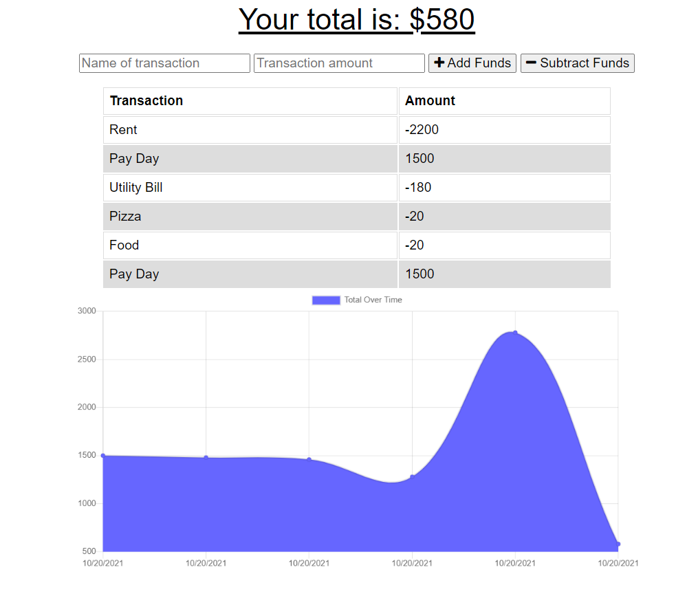
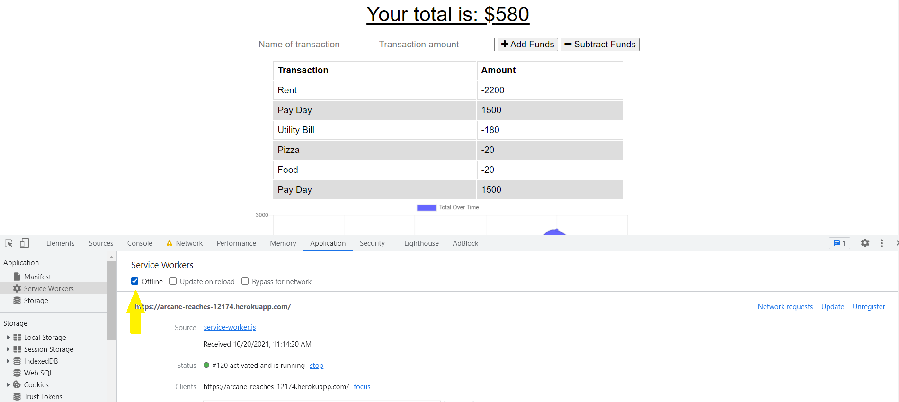
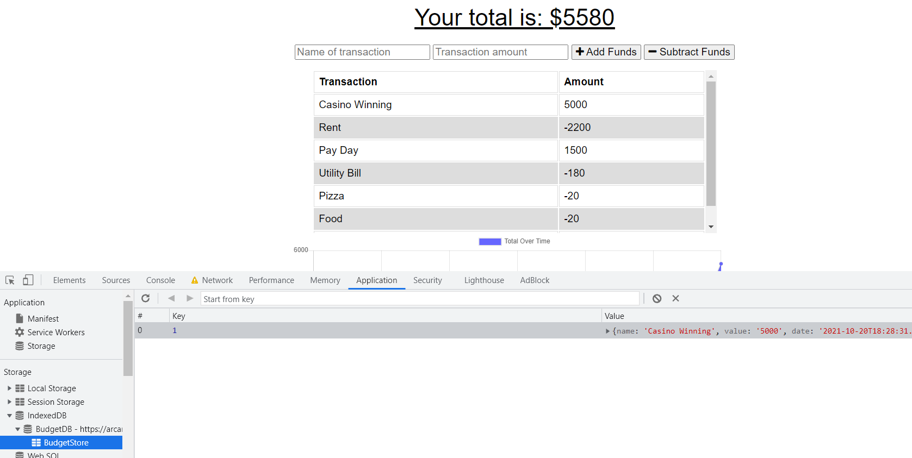
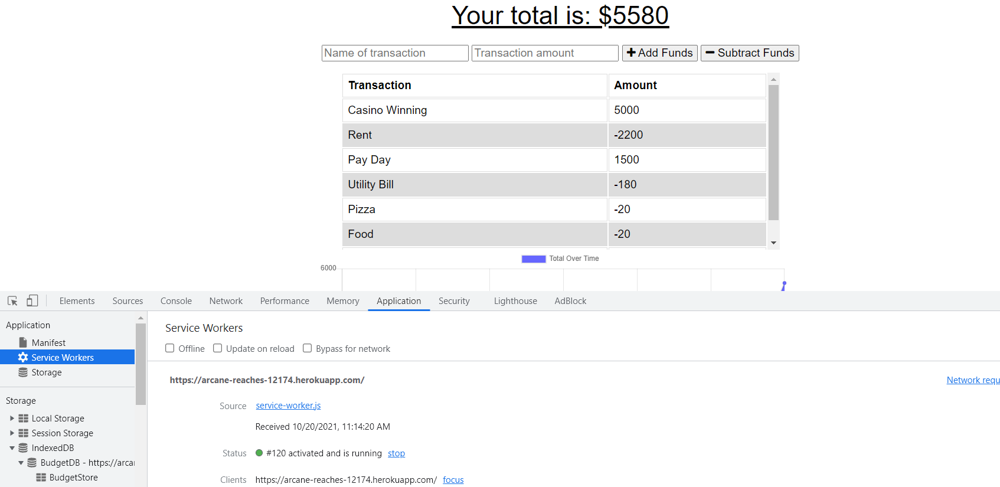

# <ins>Budget Tracker</ins>

## <ins>Description</ins>
This is a budget tracker that utilizes MongoDB and IndexedDB, to allow the user to store data about their income and expenses. The data shows up as a list and graph so one can track there current balance. It also allows the user to input data while offline into the IndexedDB, so when the user returns online, the database takes in the information and updates the page.
## <ins>Table of Contents</ins>
- [Installation](#installation)
- [Usage](#usage)
- [License](#license)
- [Features](#features)
- [Questions](#questions)

## <ins>Installation</ins>

Type `npm i` or `npm install` in the integrated terminal(if all the files do not install, attempt it again)

Run the application with `npm start`

## <ins>Usage</ins>

Link to deployed site:

https://arcane-reaches-12174.herokuapp.com/

The site works normally online, allowing you to input a transaction name and amount to either add or subtract. Doing so will create a graph showing the status of your budget.

We can also use the site offline, by navigating(in the devtools) to Application>Service Worker tab. We can mimic an offline connection by checking the box labeled offline and refreshing the page

We can then input a transaction and ensure that that the data was stored by navigating to the IndexedDB>BudgetDB>BudgetStore section of the storage section to ensure that the data has been stored to the indexedDB

We can then update the database by unselecting the offline checkbox, and reloading the page to see the IndexedDB data store the data into the database.

## <ins>License</ins>

This project is covered under MIT
## <ins>Features</ins>
Allows users to store offline data inside IndexedDB and populates the database once back online

## <ins>Questions</ins>
Contact Budget Tracker at aabazary@gmail.com. Github link: https://github.com/aabazary
